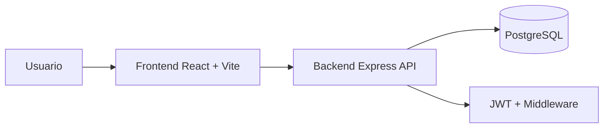

# Entrega Final EAFIT — Guía completa del proyecto (Mini Trello + CI/CD)

> Este documento está diseñado para que puedas **presentar y sustentar** el proyecto final exactamente contra los criterios del enunciado (artefacto, arquitectura, pipelines, pruebas, evidencias, ambientes, rollback y aprendizajes).

---

## 1. Resumen ejecutivo

### Artefacto de software elegido
Se implementó un **Sistema de Gestión de Tareas en Equipo (Mini Trello)**, compuesto por:
- **Frontend web** (React + Vite).
- **Backend API REST** (Node.js + Express).
- **Base de datos PostgreSQL** modelada con Prisma ORM.

Cumple con el requisito de complejidad media porque tiene **más de dos componentes claramente desacoplados** (frontend, backend, DB y pipeline CI/CD como soporte transversal).

### Problema que resuelve
Permite a equipos organizar tareas por tableros y listas, con autenticación, asignación de responsables, actualización de estado y trazabilidad básica.

### Funcionalidades clave
- Registro / login con JWT.
- Creación de tableros y membresías.
- Gestión de listas por tablero.
- Gestión de tareas por lista.
- Movimiento de tareas entre listas y estados (`TODO`, `DOING`, `DONE`).
- Asignación de tareas a miembros del tablero.
- Eliminación de tareas/listas.

---

## 2. Arquitectura de software (qué se hizo y por qué)

## 2.1 Vista general


## 2.2 Componentes
- **Frontend**: interfaz de usuario y consumo de API por token.
- **Backend**: reglas de negocio, validaciones, control de permisos por membresía.
- **DB**: persistencia relacional de usuarios, tableros, listas y tareas.
- **Prisma**: mapeo ORM, migraciones, seed.

## 2.3 Razones de diseño
- Separación de responsabilidades por módulos (`auth`, `boards`, `lists`, `tasks`, `users`).
- Seguridad básica para un entorno académico: hash de contraseña, JWT, rutas privadas.
- Arquitectura simple pero demostrable para CI/CD completo.

---

## 3. Estrategia de versionamiento / ramificación

Se adoptó una estrategia tipo **GitFlow simplificada**:
- `feature/*`: desarrollo de funcionalidades.
- `develop`: integración y entorno de **staging**.
- `main`: versión estable y entorno de **producción**.

### Justificación
- Permite separar claramente validación temprana (develop) de releases estables (main).
- Facilita explicar en presentación **qué pipeline corre según cada rama/evento**.

---

## 4. Diseño del pipeline CI/CD (paso a paso)

## 4.1 CI (`.github/workflows/ci.yml`)

### Trigger
- `pull_request` y `push` sobre `develop` y `main`.

### Flujo
1. Checkout del código.
2. Setup de Node.
3. Instalación de dependencias.
4. Lint (`eslint`).
5. Tests (`vitest`) + coverage.
6. Build frontend y backend.
7. Publicación de artefactos de coverage.

### Objetivo
Garantizar calidad mínima antes de desplegar.

## 4.2 CD Staging (`deploy-staging.yml`)

### Trigger
- `push` a `develop`.

### Flujo
1. Validación básica (instalación + tests backend).
2. Solicitud de deploy a Render (staging).
3. Smoke test contra `STAGING_API_URL/api/health`.

### Objetivo
Detectar problemas antes de producción.

## 4.3 CD Producción (`deploy-production.yml`)

### Trigger
- `push` a `main` o `workflow_dispatch` manual.

### Flujo
1. Validación de build frontend.
2. Solicitud de deploy a Render (producción).
3. Smoke test post deploy `PRODUCTION_API_URL/api/health`.

### Objetivo
Verificar disponibilidad post-release.

## 4.4 Rollback (`rollback.yml`)

### Trigger
- Manual (`workflow_dispatch`) con parámetros:
  - `service_id`
  - `deploy_id`

### Flujo
1. Ejecuta endpoint de rollback de Render.
2. Valida health de producción.

### Objetivo
Botón de pánico ante incidentes.

---

## 5. Integración de ramas con pipelines (qué corre y cuándo)

| Rama / evento | Pipeline | Resultado esperado |
|---|---|---|
| PR a `develop`/`main` | CI | Validación de calidad antes de merge |
| Push a `develop` | CI + Deploy Staging | Build/test + publicación en staging |
| Push a `main` | CI + Deploy Production | Release y validación post deploy |
| Manual (`workflow_dispatch`) | Rollback | Reversión controlada |

---

## 6. Pruebas implementadas (robustez y cobertura)

## 6.1 Backend
- `health.test.js`: disponibilidad del servicio.
- `flows.test.js`: registro, creación de tablero/lista/tarea, mover tarea y validación de permisos.

## 6.2 Frontend
- `BoardCard.test.jsx`: render de componente crítico de dashboard.
- `LoginPage.test.jsx`: flujo básico de login.

## 6.3 Entorno de ejecución
- Local: `npm run test` (backend + frontend).
- CI: se ejecuta en workflow `ci.yml` como gate.

## 6.4 Qué valida cada tipo
- **Estáticas**: lint y convenciones.
- **Unitarias/integración liviana**: reglas de negocio y rutas críticas.
- **Smoke tests de ambiente**: endpoint health tras despliegue.

---

## 7. Evidencia que debes mostrar en la presentación

## 7.1 Evidencia de pipeline exitoso
En GitHub Actions mostrar:
- Ejecución exitosa de `CI`.
- Ejecución de `Deploy Staging` con smoke test verde.
- Ejecución de `Deploy Production` con smoke test verde.

## 7.2 Evidencia de las 3 modificaciones/introducciones pedidas
1. **Quality Gate en CI**: lint + test + coverage + build.
2. **Separación de ambientes**: staging y producción por ramas/workflows distintos.
3. **Resiliencia operativa**: smoke tests + rollback manual.

## 7.3 Evidencia de app funcional por ambiente
- Login con usuario demo.
- Dashboard con tableros.
- Vista kanban con listas y tareas.
- Cambio de estado/movimiento de tarea.

---

## 8. Mapeo directo con el enunciado de clase

### CI mínimo solicitado
- Checkout ✅
- Build ✅
- Test estáticas/unitarias/cobertura ✅
- Release (artefacto) ✅ (build + publish path para frontend estático)

### CD mínimo solicitado
- IaC ✅ (`render.yaml`)
- Deploy infra/app en 2 ambientes ✅
- Tests pre/post deploy ✅ (smoke tests)
- Rollback por fallo/manual ✅ (`rollback.yml`)

---

## 9. Cómo correr el proyecto (paso a paso)

## 9.1 Opción recomendada: Docker Compose
```bash
docker compose up --build
```

Servicios esperados:
- Frontend: `http://localhost:5173`
- Backend: `http://localhost:4000/api/health`
- PostgreSQL: `localhost:5432`

## 9.2 Configuración opcional de seed
```bash
cd backend
npm install
npx prisma migrate dev
npm run prisma:seed
```

Usuario demo:
- `ana@demo.com`
- `password123`

---

## 10. Variables y secretos

## 10.1 Local (`.env`)
### Backend
- `PORT`
- `DATABASE_URL`
- `JWT_SECRET`
- `CORS_ORIGIN`

### Frontend
- `VITE_API_URL`

## 10.2 GitHub Actions (Secrets)
- `RENDER_API_KEY`
- `RENDER_STAGING_SERVICE_ID`
- `RENDER_PROD_SERVICE_ID`
- `STAGING_API_URL`
- `PRODUCTION_API_URL`

---

## 11. Guion sugerido para sustentar (10–15 min)

1. **Problema + artefacto** (1 min).
2. **Arquitectura** (2 min) mostrando diagrama.
3. **Demo funcional** (3 min): login → tablero → lista → tarea → mover estado.
4. **Estrategia de ramas** (1 min).
5. **Pipeline CI** (2 min) mostrando logs exitosos.
6. **Staging/Producción + smoke tests** (2 min).
7. **Rollback manual** (1 min) explicando botón de pánico.
8. **Desafíos y aprendizajes** (2 min).

---

## 12. Desafíos y aprendizajes (ejemplo para socialización)

### Desafíos
- Alinear tests con estructura modular sin sobre-ingeniería.
- Configurar pipelines separados por ambiente con validaciones claras.
- Mantener simplicidad visual de la app y trazabilidad CI/CD.

### Aprendizajes
- Importancia de quality gates tempranos.
- Valor de staging para reducir riesgo de producción.
- Necesidad de rollback operativo aun en proyectos académicos.

---

## 13. Checklist final de entrega

- [ ] README actualizado y coherente.
- [ ] Evidencia de runs en Actions (capturas/logs).
- [ ] Deploy staging funcional.
- [ ] Deploy producción funcional.
- [ ] Smoke tests en ambos ambientes.
- [ ] Rollback probado manualmente (al menos en simulación).
- [ ] Demo preparada con usuario seed.

---

## 14. Apéndice: comandos útiles

```bash
# Instalar dependencias del monorepo
npm install

# Calidad
npm run lint
npm run test
npm run build

# Backend
cd backend
npm run dev

# Frontend
cd frontend
npm run dev
```

